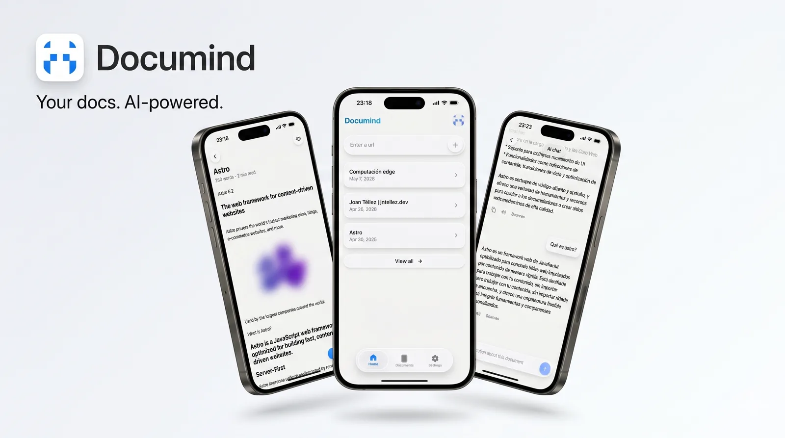

<div align="center">

# Documind



Read, organize, and chat with your documents.

</div>

## Stack

- **Monorepo** — [pnpm](https://pnpm.io/workspaces)
- **Mobile** — [Expo](https://expo.dev), [React Native](https://reactnative.dev), [TypeScript](https://www.typescriptlang.org)
- **API** — [Bun](https://bun.sh), [Hono](https://hono.dev), [PostgreSQL](https://www.postgresql.org)
- **Auth** — Google + GitHub OAuth
- **Data** — document storage, chat history, offline-first sync, and local [SQLite](https://www.sqlite.org) via [expo-sqlite](https://docs.expo.dev/versions/latest/sdk/sqlite/)

## Monorepo

- `apps/mobile` — Expo app for reading, saving, and chatting with documents
- `apps/api` — Bun API for auth, ingestion, persistence, and chat endpoints
- `apps/web` — Next.js landing and official Android download site backed by GitHub Releases metadata
- `packages` — shared workspace packages

## Quick Start

1. Install dependencies:

```bash
pnpm install
```

2. Create local env files:

```bash
cp apps/api/.env.example apps/api/.env
cp apps/mobile/.env.example apps/mobile/.env
cp apps/web/.env.example apps/web/.env.local
```

3. Start the API, mobile app, or official landing:

```bash
pnpm api:dev
pnpm mobile:start
pnpm web:dev
```

4. Open the mobile app with Expo Go or a simulator:

```bash
pnpm mobile:android
# or
pnpm mobile:ios
# or
pnpm mobile:web
```

## Scripts

```bash
pnpm mobile:start
pnpm mobile:android
pnpm mobile:ios
pnpm mobile:web

pnpm api:dev
pnpm api:start

pnpm web:dev
pnpm web:build
pnpm web:test
pnpm web:typecheck

pnpm typecheck
pnpm validate
pnpm test
```

## Environment

Create these files before running the project:

```bash
cp apps/api/.env.example apps/api/.env
cp apps/mobile/.env.example apps/mobile/.env
cp apps/web/.env.example apps/web/.env.local
```

Key services used in production:

- **API** — Render
- **Database** — Supabase
- **CI/CD** — GitHub Actions

## Distribution

- Android distribution uses the official `apps/web` landing plus **direct APK delivery**.
- GitHub Releases is the canonical APK source for the public Android download flow.
- Release tags should follow `v{version}`.
- Release assets should follow `documind-android-v{version}.apk` so the landing can resolve the latest trusted download automatically.
- The mobile build profile for this lives in `apps/mobile/eas.json` under `android-apk`.
- `apps/web` revalidates GitHub Release metadata every 15 minutes, so normal APK releases do not require a web redeploy.
- Local landing verification commands:

```bash
pnpm web:test
pnpm web:typecheck
pnpm web:build
```

- Privacy policy: `docs/privacy-policy.md`
- Release checklist: `docs/release-checklist.md`
- Web deploy: `docs/web-deploy.md`
- Smoke test: `docs/smoke-test.md`
- Observability setup: `docs/observability.md`

## Troubleshooting

### Mobile cannot reach the API

- confirm the API is running
- confirm mobile env values are correct
- restart Expo after env changes

### Auth does not work

- verify Google/GitHub OAuth env variables
- verify redirect URIs match the configured app values

### Backend looks up but features fail

- check `GET /health`
- review Render logs
- confirm Supabase is available and not paused

### Android release build fails

- confirm you are logged into EAS
- run the build from `apps/mobile`
- verify `apps/mobile/eas.json` uses the `android-apk` profile

## Docker

```bash
pnpm docker:up
pnpm docker:logs
pnpm docker:down
```

## License

[MIT](LICENSE)
